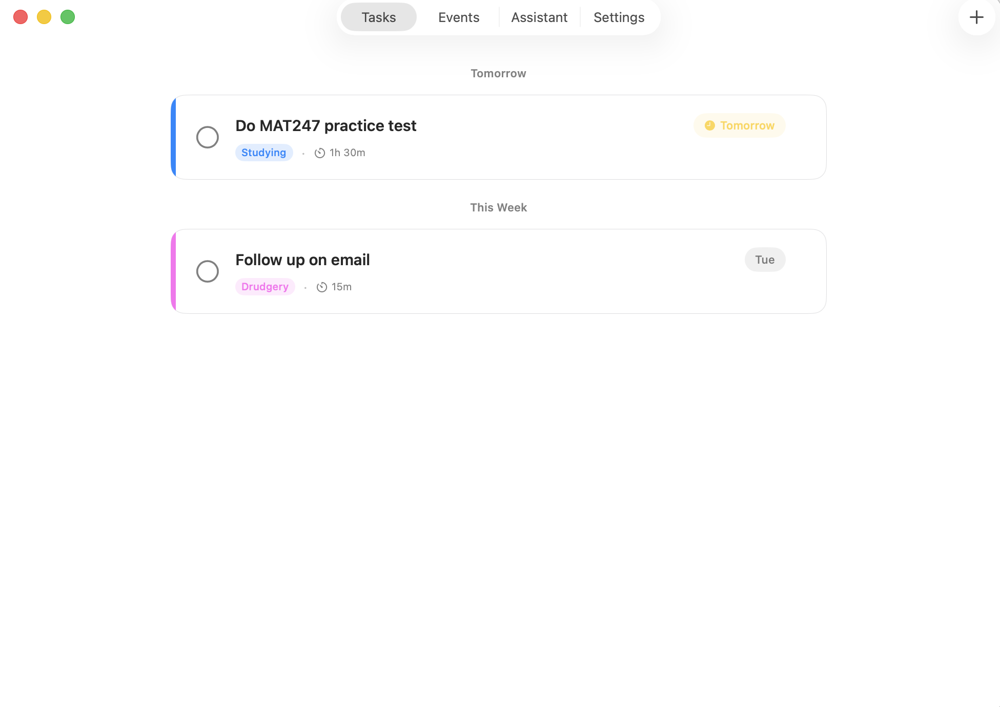
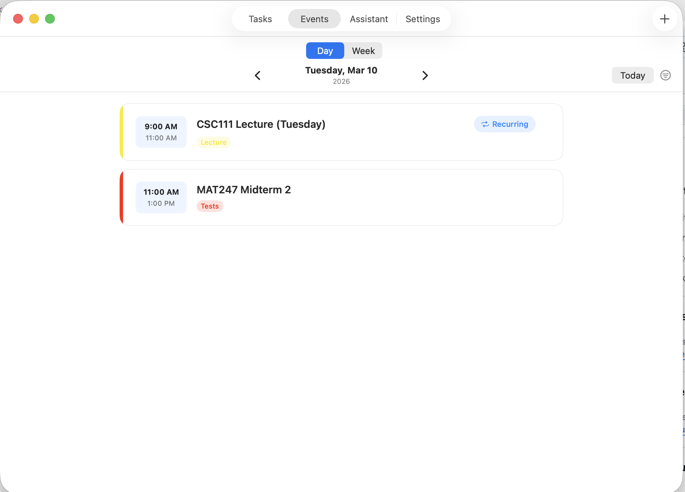
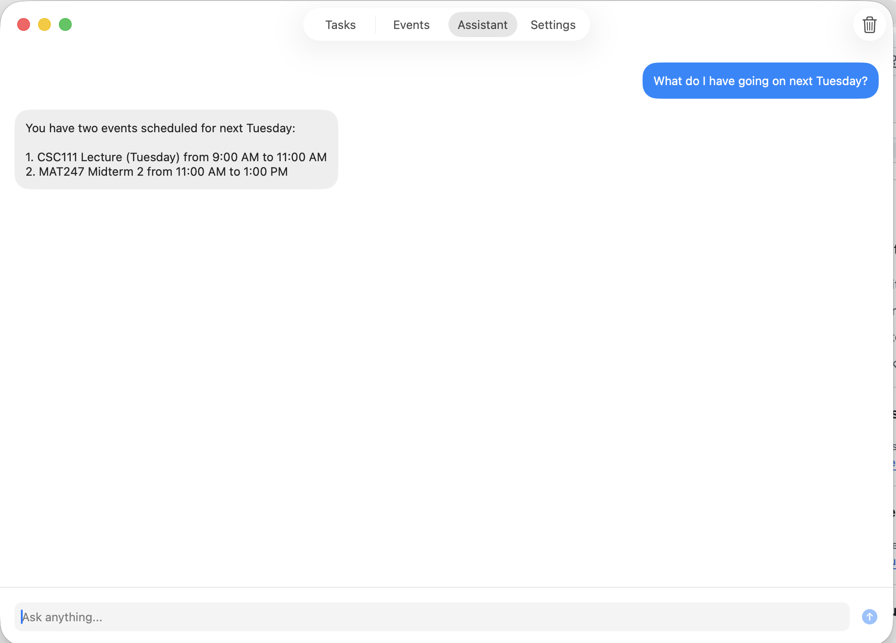

# NekoTasks

A personal task management and calendar app with a built-in AI assistant. 

## Features

**Tasks:**
Add tasks with deadlines, urgency, and labels.
  

  
**Events:**
Keep track of one-time and recurring events (like regular meetings or lectures) in your calendar
  

  

**Assistant:**
Ask the built-in assistant about your schedule and ask it to create tasks or events. Runs on Apple Intelligence.
  

  

## Installation

1. Clone the repository:
```bash
   git clone https://github.com/TheUnicat/NekoTasks.git
   cd NekoTasks
```
2. Open the project in Xcode.
3. Press **⌘R** to build and run.
(AI assistant requires MacOS 26)

## Stack

- **Frontend:** SwiftUI
- **Backend:** Swift
- **Database:** SwiftData

## TODOs

- [ ] Add Apple Mail integration and have the assistant automatically read and add important emails to tasks or calendar.
- [ ] A projects feature to group tasks.
- [ ] Smart notifications

## License

[MIT](LICENSE)
